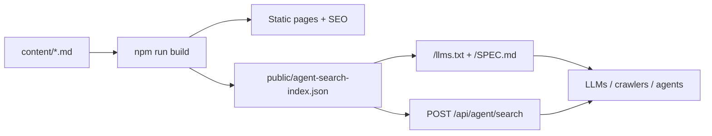

# Sazanami

[English](README.md) | **日本語**

**人にもエージェントにも読めるコーポレートサイトスターター。**

Sazanami は、コンテンツ量のある小規模なコーポレートサイト向けの **Next.js スターター**です。特徴は、Markdown サイトに **薄い検索レイヤー**を足していることです。AI エージェント、社内ツール、ヘルプウィジェットなどが、公開サイトのコンテンツを Pull 型で取得できます。

Next.js + Markdown + i18n に、`llms.txt`、ビルド時生成の知識インデックス、読み取り専用のエージェント検索 API を組み合わせています。

サイト本体は静的配信しやすいままです。`content/` 以下の Markdown がページ、ローカライズされたルート、SEO メタデータ、検索用 JSON インデックスになります。実行時の `POST /api/agent/search` は、その JSON インデックスを読み、軽量な検索結果を返します。検索サービス、クローラー、データベースは不要です。



リポジトリの package 名は `next-markdown-agent-search-starter`、スターター名は **Sazanami** です。

中身の文言・会社情報は **すべてプレースホルダ**（Example Corporation / Lorem 等）です。実サイトに使う前に必ず差し替えてください。`public/logo.png` と各種アイコンも **真っ白のプレースホルダ**です。

## なぜ Sazanami か

多くの Markdown コーポレートサイトは、ページを公開して終わりです。Sazanami はそこに小さな波を足します。AI エージェント、ヘルプウィジェット、社内ダッシュボードなどが HTML をスクレイピングせず、公開サイトの内容を検索結果として取得できる口を持たせます。

検索レイヤーは意図的に小さくしています。Algolia、Elasticsearch、ベクトルデータベースの代替ではありません。静的コンテンツサイトと、構造化された検索結果を欲しがるソフトウェアの間をつなぐ、インフラ不要の橋です。

## 含まれるもの

- **Markdown ファーストのコーポレートページ**: `content/ja/` と `content/en/` で、トップ、会社概要、リーダーシップ、プロダクト、ソリューション、お問い合わせ、法務、ニュース、財務情報を管理できます。
- **組み込み i18n**: `next-intl` による日本語・英語ルート。locale prefix は `as-needed` です。
- **ビルド時検索インデックス**: `npm run build` の前に `generate:agent-search-index` が走り、Markdown から `public/agent-search-index.json` を生成します。
- **エージェント検索 API**: `POST /api/agent/search` が、簡易スコアリングで `{ sourceKind, path, title, description, snippet }` を返します。
- **エージェント向け discovery**: `/llms.txt` と `/SPEC.md` で、LLM・クローラ・連携エージェントにサイトと生成インデックスの読み方を伝えます。
- **レイヤード構成**: domain / application / infrastructure / presentation を分け、読みやすく拡張しやすい構成にしています。
- **SEO の基本**: canonical、`hreflang`、Open Graph、sitemap、robots、Organization JSON-LD を同梱しています。
- **デプロイしやすい既定値**: Vercel 向け scripts、`main` 対象の GitHub Actions、Node 24、ESLint、Vitest、TypeScript check を含みます。

## 技術スタック

- [Next.js](https://nextjs.org/) 15（App Router）
- [TypeScript](https://www.typescriptlang.org/)
- [Tailwind CSS](https://tailwindcss.com/) 4
- [next-intl](https://next-intl-docs.vercel.app/)
- [react-markdown](https://github.com/remarkjs/react-markdown) + [remark-gfm](https://github.com/remarkjs/remark-gfm)
- Vitest + ESLint

## 必要環境

- **Node.js 24**（`.nvmrc` / `engines`）
- npm

## 開発

```bash
npm install
npm run dev      # http://localhost:3000
```

## コマンド

| コマンド | 説明 |
| --- | --- |
| `npm run dev` | 開発サーバーを起動 |
| `npm run build` | 検索インデックス生成後に本番ビルド |
| `npm run start` | 本番サーバーを起動 |
| `npm run test` | Vitest でユニットテストを実行 |
| `npm run lint` | ESLint を実行 |
| `npm run check-types` | TypeScript の型チェックを実行 |
| `npm run generate:agent-search-index` | `public/agent-search-index.json` のみ再生成 |

## コンテンツモデル

Markdown は `content/{locale}/` から読み込まれます。

- 通常ページ: `content/{locale}/{slug}.md`
- ニュース記事: `content/{locale}/news/{articleSlug}.md`
- 財務情報: `content/{locale}/company/financials/{period}.md`
- 静的ページの slug: `src/presentation/content/sitePages.ts`

ページ slug を追加したら `SITE_PAGE_SLUGS` にも追加してください。プリレンダー、sitemap、エージェント検索の対象になります。

## エージェント検索 API

Sazanami はビルド時に Markdown から小さなインデックスを生成し、そのファイルに対する読み取り専用検索を提供します。

| 項目 | 内容 |
| --- | --- |
| エンドポイント | `POST /api/agent/search` |
| ボディ | `q`（必須・既定で最大 300 文字）、`locale`（任意・既定 `ja`）、`limit`（任意・1〜50） |
| 応答 | `{ hits: [{ sourceKind, path, title, description, snippet }] }` |
| 認証 | `AGENT_SEARCH_API_KEY` 設定時は `Authorization: Bearer <key>` または `X-API-Key: <key>` |

本番では `AGENT_SEARCH_API_KEY` が未設定の場合、API は `401` を返します。非 production ではローカル検証のためキーなしリクエストを許可します。

## エージェント向け discovery

Sazanami は、LLM・クローラ・連携エージェント向けの discovery resource も公開します。

- **`/llms.txt`** — サイト、知識インデックス、検索 API への簡潔な案内。
- **`/SPEC.md`** — `agent-search-index.json` と `POST /api/agent/search` のスキーマ・HTTP 仕様。
- **`/agent-search-index.json`** — 生成済みのサイト知識インデックス。

これらは document head からリンクされ、`sitemap.xml` にも含まれます。

## 環境変数

`.env.example` を参照。

- **`NEXT_PUBLIC_APP_URL`** — 本番サイトの確定オリジン（`https://…`）。`metadataBase`、canonical、Open Graph URL に使います。無効な値は無視され、Vercel の環境 URL などにフォールバックします。
- **`NEXT_PUBLIC_CONTACT_FORM_EMBED_URL`** — お問い合わせページに埋め込むフォーム URL。Google Forms の `embedded=true` URL など。未設定の場合はプレースホルダを表示します。
- **`AGENT_SEARCH_API_KEY`** — `POST /api/agent/search` 用の任意 API キー。
- **`AGENT_SEARCH_MAX_QUERY_LENGTH`** — 検索 `q` の最大文字数（既定値: `300`）。

## プロジェクト構成

```text
content/                 # locale ごとの Markdown コンテンツ
scripts/                 # ビルド時インデックス生成
src/domain/              # Entity / Value Object / Repository interface
src/application/         # Use case
src/infrastructure/      # ファイルベース Repository / Parser
src/presentation/        # 表示向け helper / content component
src/app/                 # Next.js App Router routes
src/locales/             # next-intl messages
public/                  # 静的アセットと生成済み検索インデックス
```

## 公開用レポへの「履歴レス」載せ方（任意）

非公開の本番サイトから公開スターターを切り出す場合、過去の履歴を持たない形で公開できます。

```bash
git checkout template/develop   # 作業済みツリー
git checkout --orphan template/release
git add -A && git commit -m "Initial public template"
git remote add publish git@github.com:YOUR_ORG/next-markdown-agent-search-starter.git
git push -u publish HEAD:main
```

既存の `main` と衝突する場合は新規空レポに向けるか、`--force-with-lease` の利用をチームで確認してください。

## ライセンス

MIT — `LICENSE` を参照。公開前に、プレースホルダの Copyright を自分の名前・組織名に差し替えてください。

## 小さな但し書き

Sazanami は「さざなみ」です。もしこのスターターがいつか大波になったら、最初は一生懸命な小さな Markdown ファイルだったことを思い出してください。
