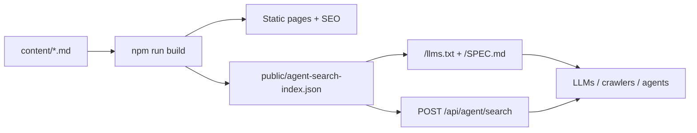

# Sazanami

**English** | [日本語](README.ja.md)

**A corporate site starter that publishes itself for humans and agents.**

Sazanami is a **Next.js corporate-site starter** for content-heavy small sites that want one extra thing: a thin, build-time search layer that agents and internal tools can pull from.

Next.js + Markdown + i18n, with `llms.txt`, a build-time knowledge index, and a read-only agent search API.

It keeps the public website simple and static-friendly. Markdown files under `content/` become pages, localized routes, SEO metadata, and a generated JSON index. At runtime, `POST /api/agent/search` reads that index and returns lightweight search hits. No hosted search service, crawler, or database is required.



The repository package name is `next-markdown-agent-search-starter`. The starter name is **Sazanami**.

All copy and company information are **placeholders** (Example Corporation, Lorem, etc.). Replace them before using this for a real site. `public/logo.png` and the icon files are **solid white placeholders**.

## Why Sazanami?

Most Markdown corporate sites stop at publishing pages. Sazanami adds a small ripple: a retrieval surface for AI agents, help widgets, internal dashboards, or other tools that need to read your public site content without scraping HTML.

The search layer is intentionally modest. It is not a replacement for Algolia, Elasticsearch, or a vector database. It is a zero-infrastructure bridge between a static content site and software that wants structured search results.

## What You Get

- **Markdown-first corporate pages**: edit `content/ja/` and `content/en/` to manage home, company, leadership, products, solutions, contact, legal, news, and financial pages.
- **Built-in i18n**: `next-intl` powers Japanese and English routes with `as-needed` locale prefixes.
- **Build-time search index**: `npm run build` runs `generate:agent-search-index` and writes `public/agent-search-index.json` from the Markdown content.
- **Agent search API**: `POST /api/agent/search` returns `{ sourceKind, path, title, description, snippet }` hits using simple token scoring.
- **Agent discovery**: `/llms.txt` and `/SPEC.md` explain the site and the generated index to LLMs, crawlers, and integration agents.
- **Layered architecture**: domain, application, infrastructure, and presentation code are separated enough to be easy to inspect and extend.
- **SEO basics**: canonical URLs, `hreflang`, Open Graph metadata, sitemap, robots, and Organization JSON-LD are included.
- **Deploy-ready defaults**: Vercel-friendly scripts, GitHub Actions CI on `main`, Node 24, ESLint, Vitest, and TypeScript checks.

## Stack

- [Next.js](https://nextjs.org/) 15 (App Router)
- [TypeScript](https://www.typescriptlang.org/)
- [Tailwind CSS](https://tailwindcss.com/) 4
- [next-intl](https://next-intl-docs.vercel.app/)
- [react-markdown](https://github.com/remarkjs/react-markdown) + [remark-gfm](https://github.com/remarkjs/remark-gfm)
- Vitest + ESLint

## Requirements

- **Node.js 24** (see `.nvmrc` / `engines`)
- npm

## Getting Started

```bash
npm install
npm run dev      # http://localhost:3000
```

## Scripts

| Script | Purpose |
| --- | --- |
| `npm run dev` | Start the development server |
| `npm run build` | Generate the search index and run a production build |
| `npm run start` | Start the production server |
| `npm run test` | Run unit tests with Vitest |
| `npm run lint` | Run ESLint |
| `npm run check-types` | Run TypeScript type checking |
| `npm run generate:agent-search-index` | Regenerate `public/agent-search-index.json` only |

## Content Model

The starter reads Markdown from `content/{locale}/`.

- Regular pages live at `content/{locale}/{slug}.md`.
- News articles live at `content/{locale}/news/{articleSlug}.md`.
- Financial statements live at `content/{locale}/company/financials/{period}.md`.
- Static page slugs are listed in `src/presentation/content/sitePages.ts`.

When you add a new page slug, add it to `SITE_PAGE_SLUGS` so it is prerendered, included in the sitemap, and indexed for agent search.

## Agent Search API

Sazanami generates a compact index from Markdown at build time, then serves read-only search over that file.

| Item | Detail |
| --- | --- |
| Endpoint | `POST /api/agent/search` |
| Body | `q` (required, max 300 chars by default), `locale` (optional, default `ja`), `limit` (optional, 1–50) |
| Response | `{ hits: [{ sourceKind, path, title, description, snippet }] }` |
| Auth | `Authorization: Bearer <key>` or `X-API-Key: <key>` when `AGENT_SEARCH_API_KEY` is set |

In production, if `AGENT_SEARCH_API_KEY` is not set, the API returns `401`. In non-production environments, missing keys are allowed for local testing.

## Agent Discovery

Sazanami also exposes discovery resources for LLMs, crawlers, and integration agents:

- **`/llms.txt`** — a concise guide to the site, the knowledge index, and the search API.
- **`/SPEC.md`** — the schema and HTTP contract for `agent-search-index.json` and `POST /api/agent/search`.
- **`/agent-search-index.json`** — the generated site knowledge index.

These resources are linked from the document head and included in `sitemap.xml`.

## Environment Variables

See `.env.example`.

- **`NEXT_PUBLIC_APP_URL`** — Canonical site origin (`https://…`) for `metadataBase`, canonical, and Open Graph URLs. Invalid values are ignored with a fallback to Vercel environment URLs.
- **`NEXT_PUBLIC_CONTACT_FORM_EMBED_URL`** — Embed URL for the contact page, such as a Google Forms `embedded=true` URL. If unset, a placeholder panel is shown.
- **`AGENT_SEARCH_API_KEY`** — Optional API key for `POST /api/agent/search`.
- **`AGENT_SEARCH_MAX_QUERY_LENGTH`** — Optional maximum length for search `q` (default: `300`).

## Project Structure

```text
content/                 # Markdown content by locale
scripts/                 # Build-time index generation
src/domain/              # Entities, value objects, repository interfaces
src/application/         # Use cases
src/infrastructure/      # File-backed repositories and parsers
src/presentation/        # View helpers and UI-facing content components
src/app/                 # Next.js App Router routes
src/locales/             # next-intl messages
public/                  # Static assets and generated search index
```

## Publishing a Clean History (Optional)

If you are deriving a public starter from a private production site, publish with no inherited commit history:

```bash
git checkout template/develop   # or your sanitized branch
git checkout --orphan template/release
git add -A && git commit -m "Initial public template"
git remote add publish git@github.com:YOUR_ORG/next-markdown-agent-search-starter.git
git push -u publish HEAD:main
```

If the remote `main` already exists, use an empty repo or coordinate with your team before using `--force-with-lease`.

## License

MIT — see `LICENSE`. Replace the placeholder copyright with your name or organization before publishing.

## Tiny Disclaimer

Sazanami means “ripple.” If this starter somehow becomes a wave, please remember that it started as a very small Markdown file trying its best.
